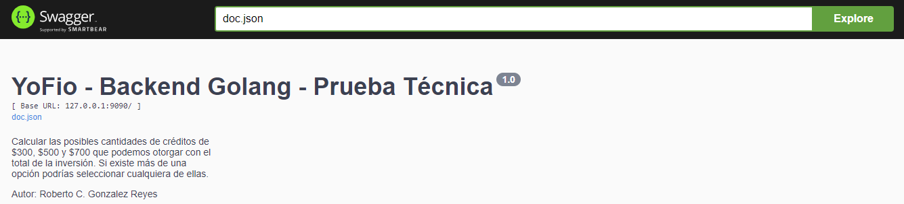
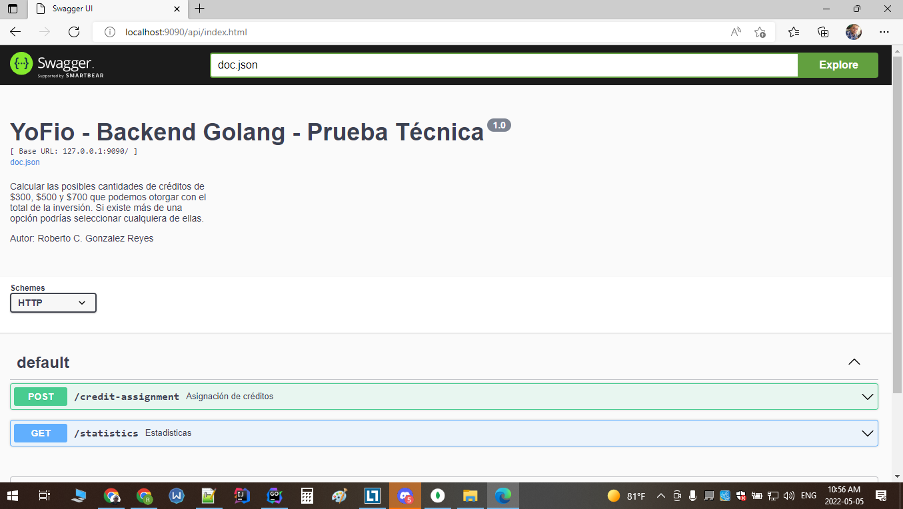
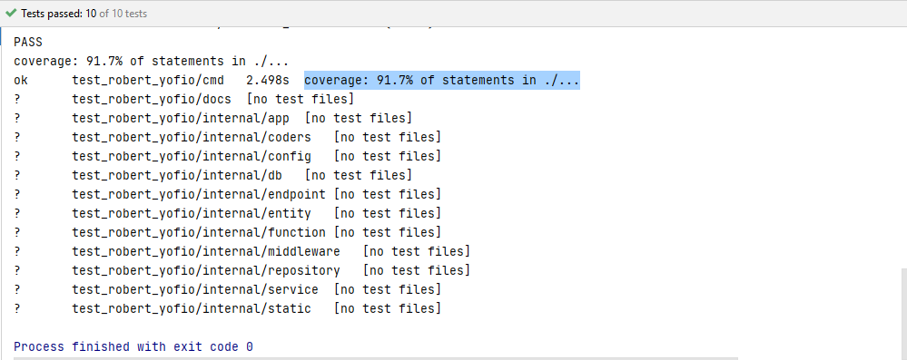

_Requisitos_
1. Tener instalado Go (v1.16.1)
2. Tener instalado MongoDB (v5.0.8) (https://www.mongodb.com/try/download/community)

_Instalación_
1. Clonar el proyecto
2. Ir al archivo **config.json** en la raíz del proyecto
3. Cambiar los valores de las variables de acuerdo a su configuración local en **config.json**
(En el caso del valor **MONGO_DATABASE** puede dejarlo como está, al inicial la app esta BD se crea)
4. Ejecutar los comandos:
   - `go build cmd/main.go`
   - `go run cmd/main.go`
   - o darle **Run** desde el Goland IDE de Jetbrains
5. Abrir un navegador y en la barra de direcciones escribir  **APP_HOST**:**APP_PORT**/api/index.html
(**APP_HOST** y **APP_PORT** son los valores que definió en el archivo **config.json**). En mi caso local quedaría: `http://localhost:9090/api/index.html`
6. Se mostrará el swagger de inicio de la app:

   
**Info:**
El proyecto tiene cobertura superior a 90 %, se usó TDD en las pruebas unitarias

